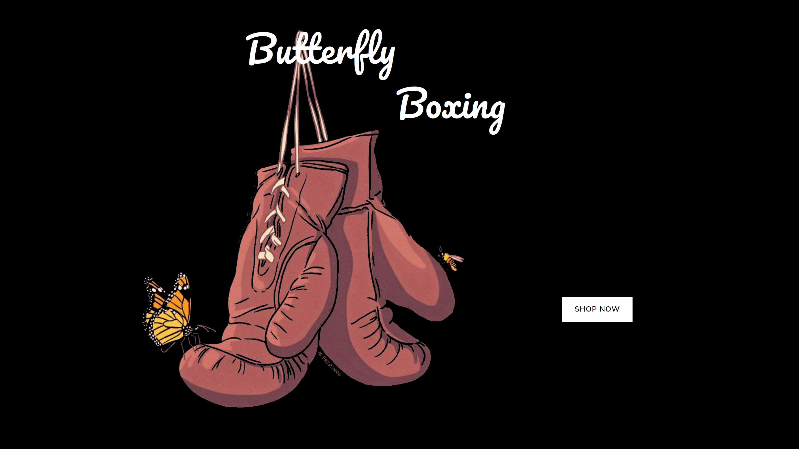
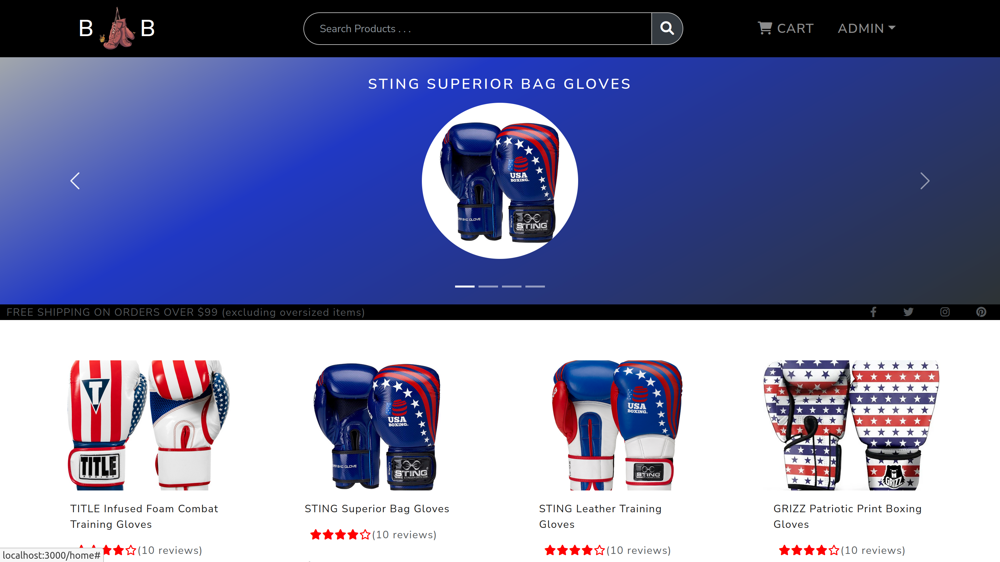
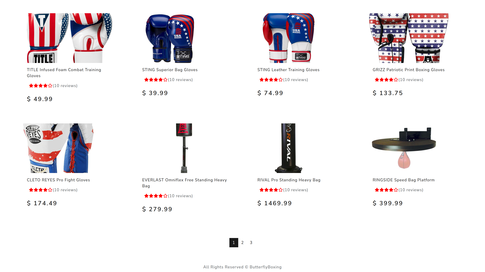
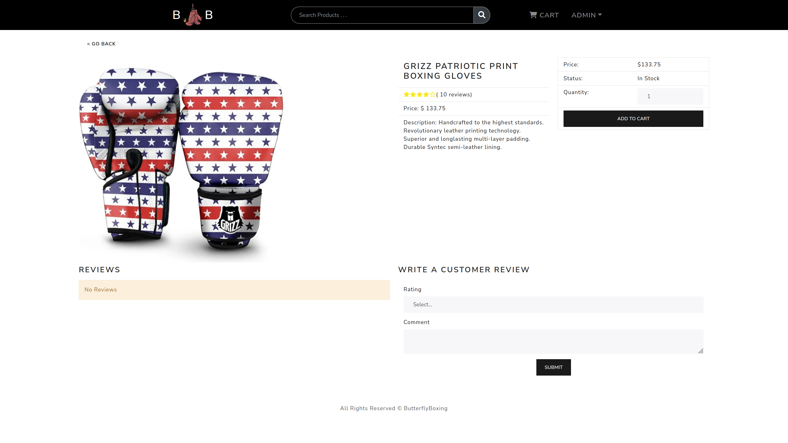
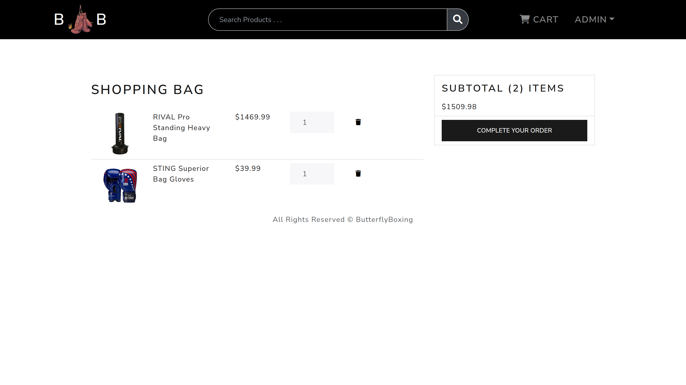
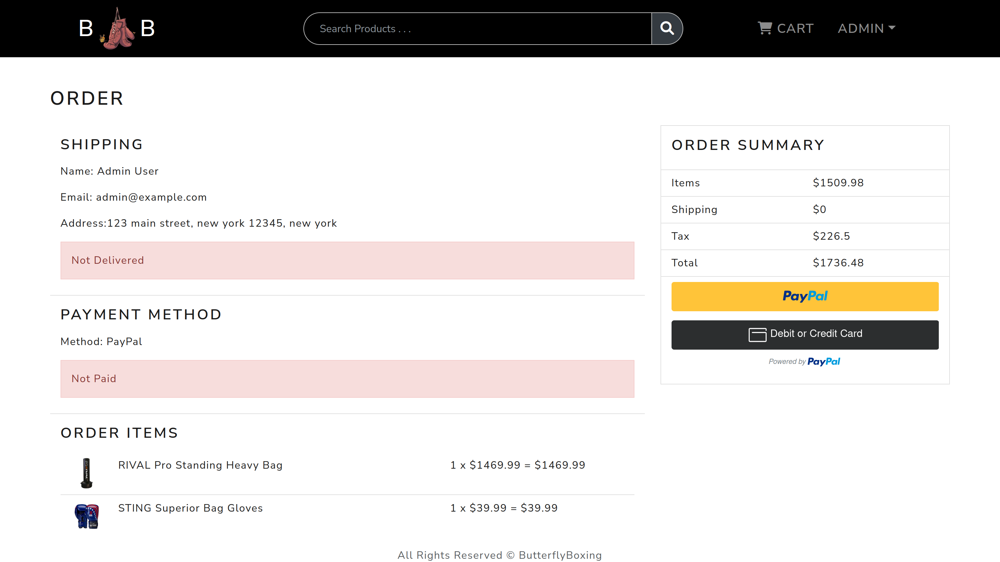
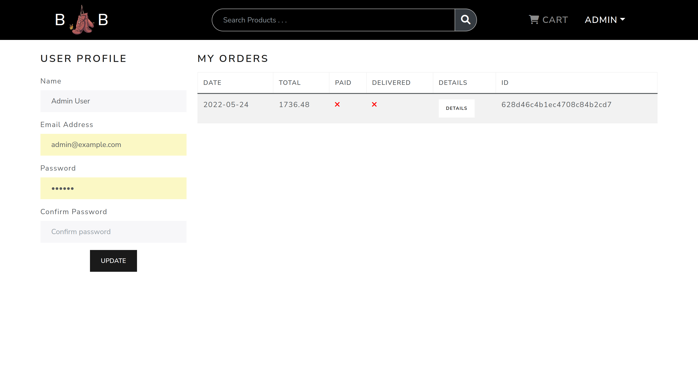
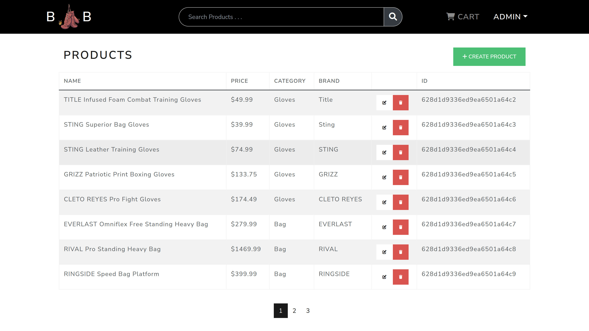
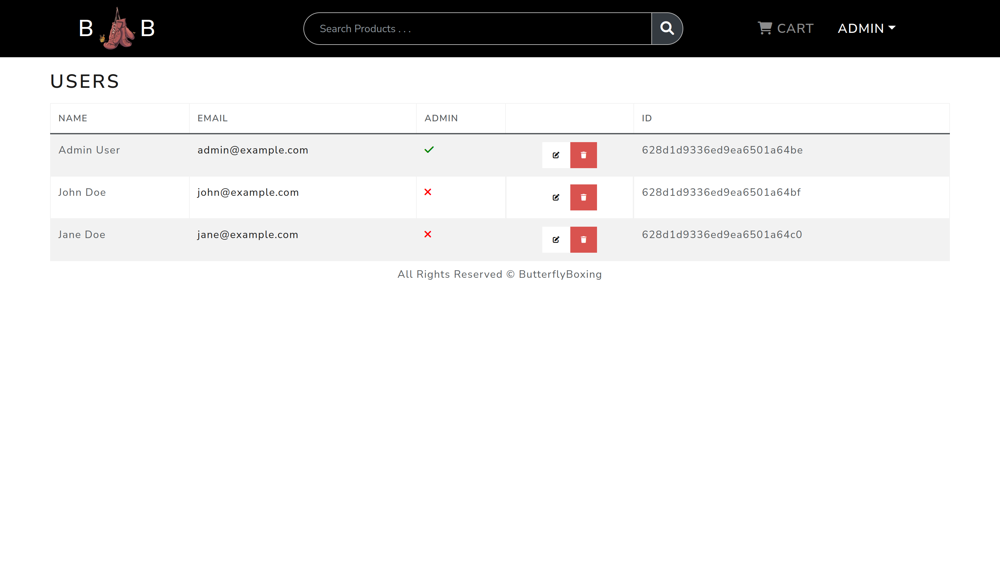

<h1>Butterfly Boxing<h1>

<h2>Link</h2>
https://butterfly-boxing.herokuapp.com/

<h2> Project Idea </h2>

Create an e-commerce website selling boxing and mixed martial arts (MMA) equipment. Browse through a broad selection of goods on the home page. The product detail page will display information about a product including reviews and rating. Add items to a cart; cart will have remove items and change quantity feature. Login/signup in order to proceed to checkout. Users will have a profile and can update their information. Checkout process will include shipping address and payment method. Admin's can view/edit/delete users and products. Admin's can also mark an order as delivered once transaction is compelte. Additional features include search bar. 

<h2>Screenshots</h2>

<h2> Wireframe </h2>
https://wireframe.cc/Iwt7O0

<h2> Trello Board </h2>
https://trello.com/b/ViVfmHQT/project-4

<h2> Entity Relationship Diagram (ERD) </h2>
https://app.moqups.com/Tj2CHdMRIyAd9CtamK0NBYwthVUVuws5/edit/page/aa458c046

<h2>Technologies Used</h2>
<ol>
<li>MongoDB(NoSQL)</li>
<li>Express</li>
<li>React </li>
<li>Node JS</li>
</ol>

<h2>Techonology Features</h2>
<li>React with Functional Components and Hooks </li>
<li>React router v6 </li>
<li>React-Bootstrap UI library</li>
<li>Component level State and Props</li>
<li>Managing global state with Redux (Actions, Thunk, Reducers)</li>
<li>Using Redux State in Components (useDispatch & useSelector)</li>
<li>Backend with Express</li>
<li>MongoDB Database and Mongoose ODM</li>
<li>JWT Authentication (JSON web token)</li>
<li>Custom authentication middleware</li>
<li>Integrating the PayPal API</li>
<li>Environment variables</li>

<h2> User Stories </h2>
<li> As a user, I want to be able to browse and choose from a variety of boxing and MMA products</li>
<li>As a user, I want to be able to view a product details screen with an image, overall rating, description, and price. </li>
<li>As a user, I want to be able to add and remove items from a cart.</li>
<li>As a user, I want to be able to login and sign up.</li>
<li>As a user, I want to be able to view my profile information and update information.</li>
<li>As a user, I want to be able to make a transaction using a payment portal.</li>
<li>As a user, I want to be able to view my order history and order status.</li>
